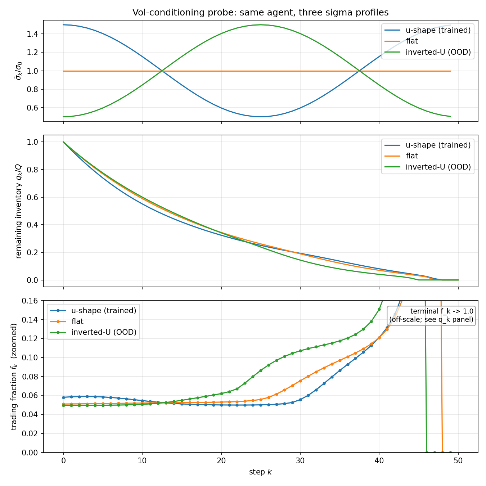

# RL Optimal Liquidation

> **This project measures when reinforcement learning adds value over Almgren–Chriss execution, and gives a structural reason it usually doesn't. Change one input of the quadratic execution problem (here, time-varying volatility) and the problem stays in the linear-quadratic family, where certainty-equivalence AC is the optimal adaptive method. Against a full ladder of exact classical baselines, the trained agent learns genuine closed-loop volatility conditioning. It beats every static classical schedule by 2.1 percentage points on all 5 seeds and captures about 73% of the certainty-equivalence ceiling. It never beats that ceiling, because nothing in this problem family can. Every baseline in the comparison is an exact optimum, not a strawman.**

A reinforcement-learning framework for optimal trade execution. The agent liquidates `Q` shares over
horizon `[0, T]` while minimizing market impact plus inventory risk. It validates against
Almgren–Chriss (1999) in the linear regime where AC is *provably optimal*, then changes one input so
that AC's fixed schedule goes stale, and tests whether the agent learns closed-loop control that
keeps up with the adaptive classical method.

> **Single source of truth for full status, the two-phase arc, and the certainty-equivalence finding: [`docs/PROJECT_STATUS.md`](docs/PROJECT_STATUS.md).**

This execution module takes positions determined by an upstream allocator (see
[RL-Portfolio-Optimization](https://github.com/OuJiaPeng/RL-Portfolio-Optimization)) and
liquidates them under real-time market conditions. Volatility forecasts from
[DL-Volatility-Forecasting](https://github.com/OuJiaPeng/DL-Volatility-Forecasting) can
serve as the σ̂ input to the Phase 2 vol-conditional policy.

## Results

| Phase | Result |
|---|---|
| **Phase 1** &nbsp;·&nbsp; recover (linear impact, AC provably optimal) | RL **recovers** AC to **+0.26–0.36%** at κT=3 (3 seeds), the regime where schedule shape is worth 7.7%, so the recovery discriminates. (The original flat-regime result was 2.84% mean over 5 seeds.) The −0.094% direct-opt residual is exactly the soft-terminal-penalty optimum, reproduced by an exact solver, which confirms the environment math. |
| **Phase 2** &nbsp;·&nbsp; degrade one input (the **certainty-equivalence ceiling**) | RL (Gaussian policy, **5/5 seeds**) beats every static classical schedule by **2.1pp** and captures **~73%** of the CE-AC ceiling. It happens because time-varying σ makes AC's *fixed* schedule stale, and an exact classical ladder prices each rung on matched scenarios (paired 95% CIs; cost gaps vs naive AC): **naive AC 0 · smart-static −1.33% · RL −3.41% [−3.93, −2.89] · CE-AC −4.66%**. The conditioning is verified causally: the action is monotone in σ̂ on 26–30 of 30 (k, q) grid cells on every seed. |

The arc stops at two phases by design. Staying in the linear-quadratic family, RL can at best tie
the smart classical method, and making RL *necessary* means leaving that family. But the same break
that weakens the classical benchmark also removes the exact ladder that makes RL's gain verifiable,
and it doesn't shrink RL's own noise floor either: the agent already leaves ~27% of the CE-AC edge
on the table (about 1.25pp) inside the one regime where everything is still exact. A harder problem
has to clear a wider floor with no referee to prove it did. The boundary is the finding. Mechanism
and the full result: [`docs/PROJECT_STATUS.md`](docs/PROJECT_STATUS.md).



*The same agent under three σ profiles, two of them never seen in training. The inventory trajectories (middle panel) diverge in the predicted direction: under inverted-U (σ high midday) the agent sells faster midday, and under u-shape (σ high at the boundaries) it sells faster at the ends. The action is monotone in σ̂ on 26–30 of 30 (k, q) grid cells on every seed (reproduce with `scripts/probe_conditioning_grid.py`).*

> **Run-dir naming:** the featured Phase 2 runs are `runs/p2_gauss_s*` (from `configs/phase2_vol_gaussian.yaml`); `runs/p2_retrain_s*` / `p2_cv_s*` are the Beta-policy and control-variate arms of the same batch.

## Methodology

| Component | Choice |
|---|---|
| Algorithm | PPO (Stable-Baselines3) with `VecNormalize`, `target_kl`, cost-based save-best |
| Policy | **Gaussian (shared log-σ), featured for Phase 2.** 5/5 seeds discover σ̂-conditioning versus the custom Beta's 2/5, because state-independent exploration wins on a discovery-limited task. Beta(α, β) stays available (`policy: beta`) and recovers AC cleanly in the Phase 1 regimes. |
| Reward | Direct execution cost (no shaping); `γ=1.0` for deterministically-terminating episodes |
| Baselines | Analytical AC + exact tridiagonal schedule solver + **classical ladder** (naive / smart-static / CE-AC, `scripts/eval_phase2_baselines.py`) + 50-parameter direct-opt + per-realization MC oracle |
| Validation | 5-seed multi-run (best AND final); state-space sensitivity probe (30-cell conditioning grid); regression suite |

## Quickstart

```bash
make install
make test
make phase1          # ~5 min, validates against AC
make phase2-vol      # ~5 min, demonstrates closed-loop σ-conditioning
make diagnose        # plots + summary.yaml for the most recent phase1 run
make ladder          # classical ladder: naive AC / smart-static / CE-AC vs trained RL
```

For the full story, including the debugging chronology, the dead-end pivots, and the
methodology lessons, see [`docs/phase1_journal.md`](docs/phase1_journal.md). The journal
documents what we tried, what failed, and what the diagnostic framework revealed about when
on-policy RL adds value over classical execution algorithms.
